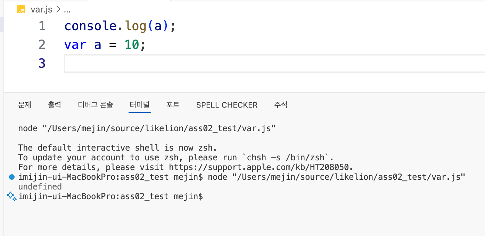
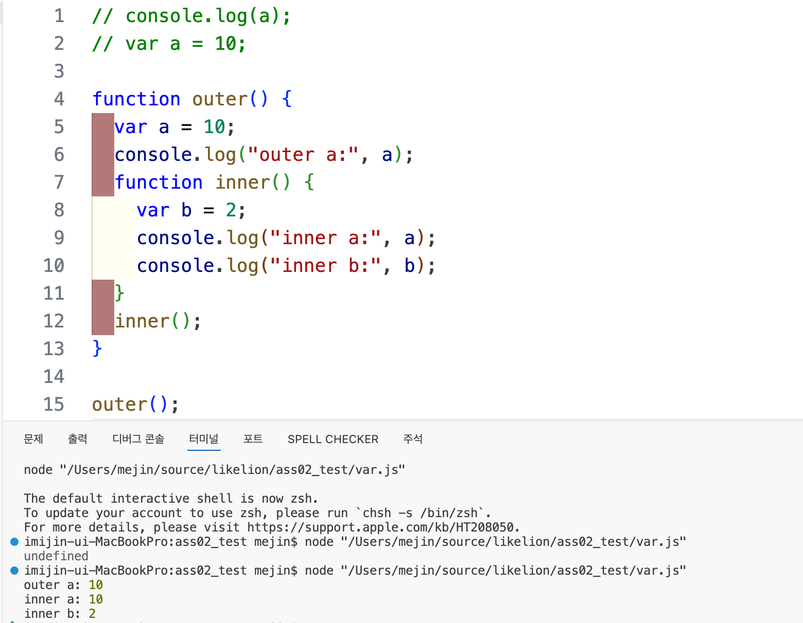
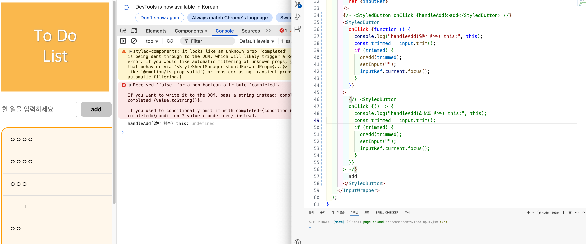
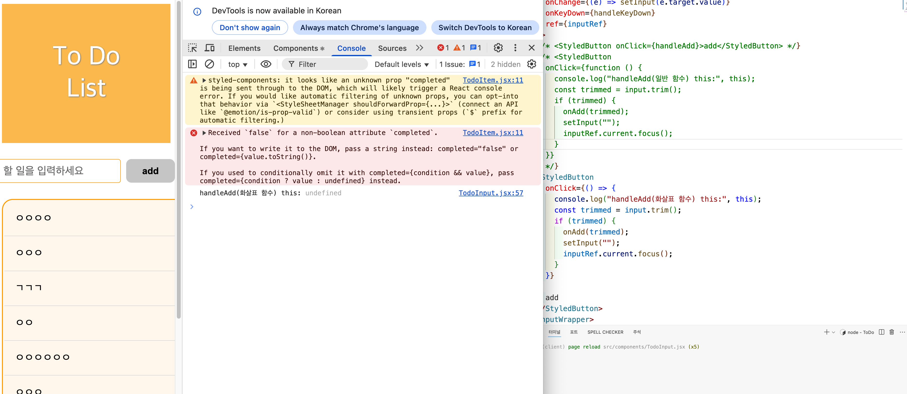

# 멋사 2차 세션 과제

## 과제 : 실행 컨텍스트를 활용한 Todo앱 **만들기**

### **필수 기능 구현**

### **1. Todo 기능**

- Todo 입력창 + 추가 버튼
- 작성한 Todo 리스트로 렌더링
- 각 Todo 항목마다:
  - 완료 처리 버튼
  - 삭제 버튼
  - (Optional) 상세보기 모달

### **2. 스타일 구현 (styled-components 사용)**

- 전체 스타일링은 styled-components만 사용
- props를 활용한 조건부 스타일링 (ex. 완료된 Todo는 회색 처리)
- 컴포넌트 단위로 스타일 분리 (ex. StyledButton.tsx, StyledInput.tsx)
- hover, focus 등 상태 반영

### **3. 실행 컨텍스트 실험**


선언문만 호이스팅되어 실행된다.
할당은 그대로 유지된다.

함수가 선언되면 함수의 내용이 정의만 되고 실행은 호출될 때 실행된다.
outer()이 실행되면서 a에 값이 할당되어 출력되고 inner()가 선언되고 실행되면서 b의 값이 할당되고 출력되는 실행 컨텍스트를 가진다.

---

### **4. this 체험**

- 이벤트 핸들러에서 일반 함수와 화살표 함수 비교


일반 함수는 이벤트 핸들러로 호출될 때, this가 해당 DOM요소로 바인딩되지만 strict mode에서는 undefined이 할당된다.

화살표 함수는 상위 스코프의 this를 그대로 상속받는데, TodoInput 컴포넌트 함수는 일반 함수이기 때문에 undefined가 할당된다. strict mode이기 때문이다.

---

### **5. DOM 직접 조작**

- useRef로 input 포커스 처리
- 또는 document.querySelector() 사용하여 input 조작
- 버튼 클릭 시 특정 요소로 스크롤 이동 등 DOM 조작 기능 최소 1개 포함
- DOM 접근이란 브라우저가 렌더링한 실제 HTML 요소에 직접 접근하는 것을 말한다.
- 포커스란 커서가 깜빡이면서 키보드 입력을 기다리는 상태이다.

---

### **✨ 선택 과제 (보너스)**

- styled-components keyframes를 이용한 간단한 애니메이션 적용
- 반응형 UI 구성
- 다크모드 테마 설정 (ThemeProvider 사용)

---

### **📁 폴더 구조 예시**

```
src/
├── components/
│   ├── TodoInput.js        # 입력창 컴포넌트
│   ├── TodoItem.js         # 개별 할 일 아이템
│   └── TodoList.js         # 할 일 목록 전체
│
├── hooks/
│   └── useConsoleLogger.js  # 실행 컨텍스트 실험용 (선택)
│
├── App.js                  # 메인 앱 컴포넌트
├── index.js                # 엔트리 포인트
│
├── styles/
│   ├── App.css             # App 전체 레이아웃 스타일
│   ├── TodoInput.css       # 입력창 스타일
│   ├── TodoItem.css        # 할 일 아이템 스타일
│   └── TodoList.css        # 목록 스타일
```

예시일뿐 참고만 해주세요!

---

### **📖 제출 방식**

- GitHub에 코드 업로드 후 퍼블리싱 (vite/CRA 등 자유)
- README.md에 다음 내용 포함 필수:
  1. 실행 컨텍스트 실험 로그 + 해석
  2. this 실험 결과 비교
  3. DOM 조작 방법 설명
  4. styled-components에서 사용한 조건부 스타일 / theme 적용 방식

---

### **🧠 참고 자료**

- styled-components 공식 문서: https://styled-components.com/docs
- JS 실행 컨텍스트 시각화 도구: https://pythontutor.com/javascript.html
- this 개념 정리: https://developer.mozilla.org/ko/docs/Web/JavaScript/Reference/Operators/this
- DOM API 정리: https://developer.mozilla.org/ko/docs/Web/API/Document/querySelector

---

### **💬 기타 안내**

- 콘솔 찍는 것만으로 끝내지 말고, 그 이유를 꼭 분석해서 작성해주세요.
- 스타일이 멋지게 나오는 것도 중요하지만, **JS 개념이 이해됐는지**가 더 중요합니다.
- 코드 주석, 커밋 메시지 깔끔하게 정리하면 가산점!
